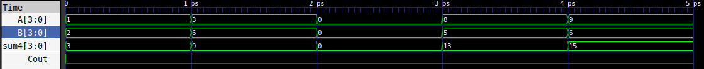
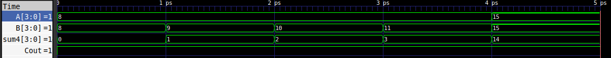

# Lab02 - Medidor de carga

# Integrantes


# Informe

Indice:

1. [Diseño implementado](#diseño-implementado)
2. [Simulaciones](#simulaciones)
3. [Implementación](#implementación)
4. [Preguntas](#preguntas)
5. [Conclusiones](#conclusiones)
6. [Referencias](#referencias)

## Diseño implementado

### Descripción

#### Detector de alarmas de descarga 

Para cumplir con los requerimientos solicitados en la guía, se empezó con el problema más sencillo. En este caso, para implementar una señal de alerta en caso de un estado de descarga por cada bateria, se puede notar que al realizar un análisis de tabla de verdad, el único caso en el que el sistema va a activar su alarma es cuando los 4 bits esten en estado bajo. 

|A_3 | A_2| A_1| A_0| Alarma|
| ----| ---- | -----| -----| ----|
|1| x|x|x| 0|
|x| 1|x|x| 0|
|x| x|1|x| 0|
|x| x|x|1| 0|
|0| 0|0|0| 1|

Por lo que la ecuación booleana que describiría el comportamiento de la alarma de una batería sería:
$$Alarma = \bar{A_3} \bar{A_2} \bar{A_1} \bar{A_0} $$

En cuanto al circuito, este podría ser implementado con dos compuertas *and* que niegen las entradas, y otra compuerta *and* que tenga como entradas las salidas de las dos compuertas.

En el caso de verilog, en el archivo de [descarga](descarga.v), se puede apreciar que primero se realizó un modulo para una batería que tuviera en cuenta una entrada de 4 bits (la carga de la batería) y una salida de 1 bit como la señal de alarma. Esta señal de alarma está representada por la función booleana mostrada con el uso de primitivas. En el mismo archivo se presenta un modelo donde se instancia el modulo de la alerta de batería 2 veces para hacerlo escalable, de esta manera se tienen 2 entradas de 4 bits que representan la carga de cada bateria y dos señales de descarga. 


#### Sumador de 1 bit

Para contruir el sumador de 4 bits fue necesario crear un bloque de sumas de 1 bit con el fin de escalarlo y resolver un problema grande con la solución de un problema más pequeño. Considerando la documentación de la guía y la teoría vista en la clase magistral, se obtienen las siguientes expresiones para las sálidas del bloque: 

$$Sum = C_{in}\oplus(a \oplus b)  $$
$$C_{out} = ab + C_{in}(a \oplus b)$$

De esta manera, en el archivo donde se encuentran los módulos del [sumador](./src/sumador.v) se puede evidenciar la implementación comportamental. En primer lugar se definió un bloque 'adder' donde se reciben de entradas un bit 'a' que se suma con un bit 'b' y un acarreo de entrada 'cin'. En el módulo se define las suunma y acarreo de sálida con las formulas mostradas a partir de las primitivas de 'verilog'. 


#### Sumador de 4 bits

En este caso, en el mismo archivo del [sumador](./src/sumador.v) se define un módulo que tiene como entradas dos numeros de 4 bits que se desean sumar y un acarreo final. En el módulo se puede observar que se utilizó una metodología escalable puesto que se instancia cuatro veces el módulo sumador de 1 bit('adder') para crear la suma de 4 bits('adder4b'). 

Es importante resaltar que el proceso se realizo bit a bit, en el archivo se muestra que se creo un modulo de suma de 1 bit para cada realizar la suma entre el n-esimo bit de A y B, pero para interconectar los módulos se utilizó un dato de tipo 'wire' como si fuera un acarreo temporal. De esta manera, este operador permitió conectar el acarreo de sálida $C_{out}$ del n-simo sumador de 1 bit al acarreo de entrada $C_{in}$ del siguiente sumador.    


### Diagramas

#### Detector de alarmas de descarga

A partir de una visualazación por ```RTL```, se puede mostrar que este bloque tiene dos entradas (nivel de carga de cada bateria) y dos sálidas (descarga por cada alarma): 

![[]](./imagenes_simulacion/diagrama_alerta_bloque.png)


#### Sumador de 1 bit


#### Sumador de 4 bits


#### Comparador


## Simulaciones 


### Simulación del bloque de alarma de descarga
Tal y como se explicó anteriormente, el segundo módulo de descarga resive dos buses de entradas de 4 bits (cada bus representa el nivel de carga de cada batería) y entrega dos salida de 1 bit (una para cada batería). En caso de que la primera batería no tenga carga (lo que corresponde a un 0000 binario) la primera salida será uno, independientemente del valor de la otra batería. Es decir, las salidas funcionan de manera independiente para cada batería.

A continuación se muestra la s*.v.bakcarga](imagenes_simulacion/Descarga_señales.png "Simulación módulo de descarga")

Como se puede evidenciar en la anterior imagen, la única combinación  de las 16 posibles que genera un 1 en la salida es la de 0 (en decimal) o *oooo* en binario.

### Simulación del sumador de 1 y 4 bits

Tal y como se mencionó anteriormente, para la implementación del sumador de 4 bits se creó primero un módulo de suma de 1 bit, con tres entradas de 1 bit (a, b, cin) y dos salidas de 1 bit (cout, sum). Mientras que para el módulo de suma de 4 bits resive dos buses de datos para cada número, cada uno de 4 bits.
#### Suma sin *carry_out* 
A continuación se muestra la simulación para distintos valores de a, b y *carry-in* para el sumador de 4 bits.


Tal y como se muestra en la imagen anterior, como la suma de los números no supera a 15 (que es lo máximo que se puede representar con 4 bits), el bus de datos *sum4* efectivamente representa la suma de los números, y el *carry_out* es 0.
#### Suma con *carry_out*

En el caso en el que la suma supero el valor de 15, sí hay *carry_out* y por tanto, el resultado de *sum4* no va a corresponder con la suma real de los números, puesto que la representación de la suma requeriría de 5 bits.

A continuación se muestra una simulación que ejemplifica la explicación anterior.


Como se puede observar en la anterior imagen, al sumar 8 + 8 se obtiene en la salida *sum4* el número 0, esto es debido a que 16, el resultado de la suma, en binario se escribe como 10000, por lo que al tomar los primeros 4 bits (que es el resultado que arroja *sum4*) el número representado es 0, en vez de 16. 
Los otros ejemplos en la simulación siguien el mismo principio.

#### Aclaración del módulo suma
La razón por la que se optó implementar esta función en vez de arrojar una única salida de 5 bits, que sí representaría la suma en todos sus casos, fue por que el programa no busca conocer la suma necesarioamene, solo generar alarmas para distintos valores de carga. Más adelante se ahondará al respecto.

### Simulación del bloque comparador


## Implementación

## Preguntas

1. ¿Qué desafíos pueden surgir al implementar en *hardware* un diseño que funcionaba correctamente en simulación?

2. Describa el enfoque estructural y comportamental en el contexto de electrónica digital y cómo los implementó en el reto. ¿Qué hace Quartus con cada uno?

3. ¿Cómo afecta el diseño del sumador y de comparadores al uso de recursos en la FPGA (LUTs, FFs, BRAMs, etc.)? Muestren el uso de recursos de su diseño.

4. ¿Qué impacto tiene aumentar el número de bits de la lectura de cada batería? ¿Qué impacto tiene aumentar el número de baterias del banco? 

5. Describa las diferencias entre los tipos de dato ```wire``` y  ```reg``` en Verilog y compare ambos con el tipo de dato ```logic``` en System Verilog.

6. Únicamente con lo que se vio en clase, describa cómo se usó el bloque ```always```. Enfoque su respuesta hacia la implementación de lógica combinacional.


## Conclusiones


## Referencias


