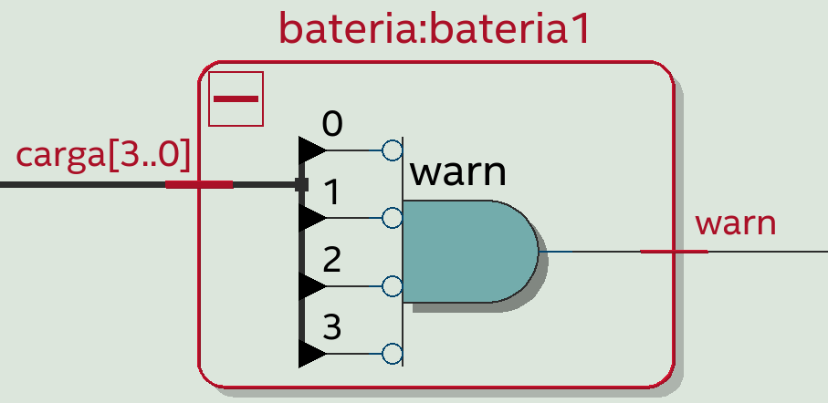
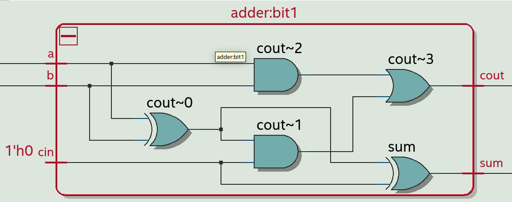
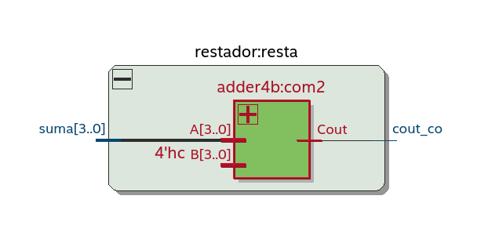
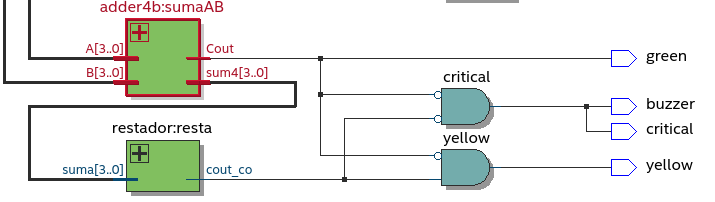
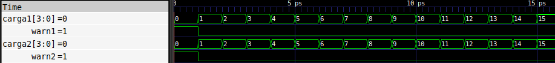
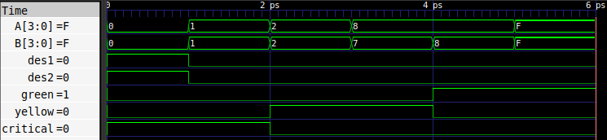
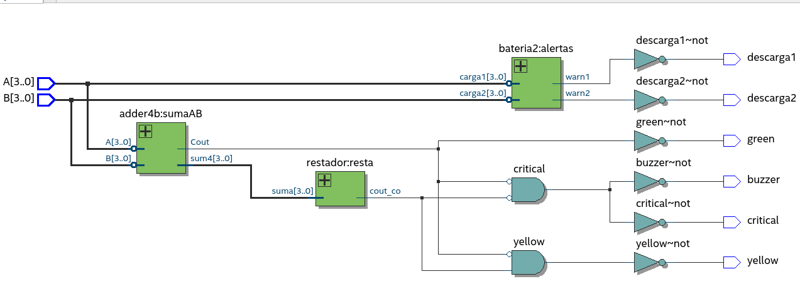
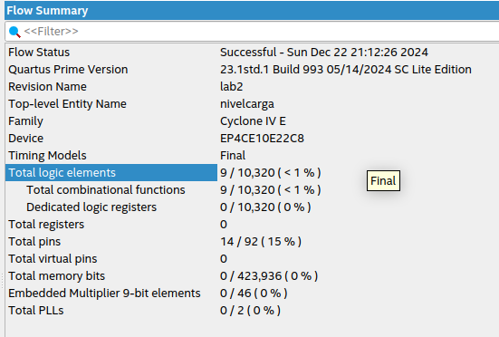

# Lab02 - Medidor de carga

# Integrantes

[Alejandro Diaz Cordoba](https://github.com/aldicor) \
[Juan David Bernal Sanchez](https://github.com/jbernalsa) \
[Juan David Sanchez Quintero](https://github.com/jdavid-sz)


# Informe

Indice:

1. [Diseño implementado](#diseño-implementado)
2. [Simulaciones](#simulaciones)
3. [Implementación](#implementación)
4. [Preguntas](#preguntas)
5. [Conclusiones](#conclusiones)
6. [Referencias](#referencias)

## Diseño implementado

### Descripción

#### Detector de alarmas de baterias 

Para cumplir con los requerimientos solicitados en la guía, se empezó con el problema más sencillo. En este caso, para implementar una señal de alerta en caso de un estado de descarga por cada batería, se puede notar que al realizar un análisis de tabla de verdad, el único caso en el que el sistema va a activar su alarma es cuando los 4 bits estén en estado bajo. 

|A_3 | A_2| A_1| A_0| Alarma|
| ----| ---- | -----| -----| ----|
|1| x|x|x| 0|
|x| 1|x|x| 0|
|x| x|1|x| 0|
|x| x|x|1| 0|
|0| 0|0|0| 1|

Por lo que la ecuación booleana que describiría el comportamiento de la alarma de una batería sería:
$$Alarma = \bar{A_3} \bar{A_2} \bar{A_1} \bar{A_0} $$

En cuanto al circuito, este podría ser implementado con dos compuertas *and* que nieguen las entradas, y otra compuerta *and* que tenga como entradas las salidas de las dos compuertas.

En el caso de verilog, en el archivo de [descarga](descarga.v), se puede apreciar que primero se realizó un módulo para una batería que tuviera en cuenta una entrada de 4 bits (la carga de la batería) y una salida de 1 bit como la señal de alarma. Esta señal de alarma está representada por la función booleana mostrada con el uso de primitivas. En el mismo archivo se presenta un modelo donde se instancia el modulo secundario de la alerta de batería 2 veces para hacerlo escalable, de esta manera se tienen 2 entradas de 4 bits que representan la carga de cada batería y dos señales de descarga (que se encuentran en el mismo archivo). 
### Sumador de 4 bits

En este caso, en el mismo archivo del [sumador](./src/sumador.v) se define un módulo que tiene como entradas dos numeros de 4 bits que se desean sumar y un acarreo final. En el módulo se puede observar que se utilizó una metodología escalable, puesto que se instancia cuatro veces el módulo sumador de 1 bit('adder') para crear la suma de 4 bits('adder4b'). 

Es importante resaltar que el proceso se realizó bit a bit, en el archivo se muestra que se creó un módulo de suma de 1 bit para realizar cada suma entre el n-esimo bit de A y B, pero para interconectar los módulos se utilizó un dato de tipo 'wire' como si fuera un acarreo temporal. De esta manera, este operador permitió conectar el acarreo de sálida $C_{out}$ del n-simo sumador de 1 bit al acarreo de entrada $C_{in}$ del siguiente sumador.    
### Alarmas mediante restador

La segunda etapa del trabajo consiste en generar 3 alarmas para tres niveles de energía en las baterías (estos niveles se miden en función de la suma de ambas). 
+ Crítico (0-3)
+ Regular (4-15)
+ Aceptable (16-30)

Las alarmas son mutuamente excluyentes, es decir, si una de estas está encendida, las otras deben estar apagadas. Por el contrario, la alarma de las baterías es una salida independiente. Si, por ejemplo, una de las baterías tiene nivel de carga 0 y otro de 1, la alarma de descarga 1 se encenderá, pero también lo hará la alarma de nivel crítico.

Para hallar las expresiones booleanas de cada una de estas alarmas se usaron dos valores: el *carry_out* de la suma de los dos números (A+B) y el *carry_out* de la suma de A+B+(-4).

#### Razonamiento utilizado

 + Si se suman los números A+B con el módulo de suma antes explicado, el valor del *carry_out* de esa suma ($C_S$) será 1 si A+B $\geq$ 16. Por el contrario, si $C_S$ es 0, entonces A+B $\leq$ 15.
 + Si se suma el nivel total de las baterías encontrado con el módulo de suma en el paso anterior con -4, es decir, con el complemento a2 de 4, el resultado del *carry_out* indicará que la suma de las baterías es mayor o menor que 3. Si el *carry_out* es igual a 1 ($C_R$), A+B $\geq$ 4, si por el contrario $C_R$ es igual a 0, A+B $\leq$ 3.

 La anterior información se puede resumir enla siguiente tabla de verdad. 
 Donde $C_S$ es el *carry_out* de la suma de las baterías (A+B), $C_R$ es el acarreo de salida de la suma de esta carga total con el complemento a2 de 4 (A+B+(-4)), y, por último, $I_1$, $I_2$ e $I_3$ son las salidas de los niveles crítico, regular y aceptable, respectivamente.   

 $C_S$ | $C_R$| $I_1$ | $I_2$| $I_3$|
| ----| ---- | -----| -----| ----|
|0| 0|1|0| 0|
|0| 1|0|1| 0|
|1| 0|0|0| 1|
|1| 1|0|0| 1|

Según la tabla anterior, las expresiones booleanas para cada alarma son:

$$I_1 = \bar{C_S}\bar{C_R}$$
$$I_2 = \bar{C_S}C_R$$
$$I_3 = C_S\bar{C_R} + C_SC_R = C_S$$

#### Aclaración
Un punto importante en el anterior diseño es la suma con -4 y no con -3, esto se debe a que si se realiza la suma con -4, el *carry_out* dividirá los números en mayores a 3 y menores o iguales a 3. Por el contrario, si se escoge -3 se dividirán los números en mayores a 2 y menores e iguales que 2. 


### Diagramas

#### Detector de alarmas de descarga

A partir de una visualización por ```RTL```, se puede mostrar que este bloque tiene dos entradas (nivel de carga de cada batería) y dos salidas (descarga por cada alarma). Además, también se muestra la construcción modular por cada batería: 

![[]](./imagenes_simulacion/diagrama_alerta_bloque.png)

En la siguiente imagen se observa que en el nivel de abstracción más bajo, la señal de cada batería se invierte y pasa bit por bit a una compuerta ```and```, tal como se planteó en la ecuación.



#### Sumador de 1 bit

Con el análisis ```RTL```, se observa el siguiente diagrama del sumador de 1 bit, este describe las ecuaciones mencionadas anteriormente. 




#### Sumador de 4 bits

En la visualización por ```RTL```, se observa la escalabilidad mencionada en la sección de la descripción. Se puede notar que se realiza un proceso bit a bit en el que se suma cada bit de 'A' y 'B', pero se conectan los módulos de sumadores de 1 bit de tal modo que el $c_{out}$ de un sumador es el $c_{in}$ del siguiente sumador de bit significativo.  


#### Restador

Como se mencionó anteriormente, una de las variables que determina el nivel lógico de las salidas que indican el nivel de batería es el *carry-out* de la suma de la carga total de las dos baterías (A+B) con el complemento a2 del número 4. 

A continuación se muestra el bloque correspondiente a este sumador (que se identificó con el nombre de "restador", puesto que realmente la suma que genera representa la resta de dichos números).


Como se puede ver en la anterior imagen, una de las entradas del restador corresponde primera salida del bloque anterior sumaAB, mientras que la otra entrada corresponde al complemento a2 de 4. Este complemento se incluye dentro del código como una constante.  

De igual manera, para visualizar de una mejor manera la estructura general del restador, a continuación se muestra su conexión en la estructura general del programa.

 

Tal y como se observa en la anterior imagen, la salida del bloque de suma es la entrada del restador. Asimismo, las variables que determinan el nivel lógico de las salidas (green, yellow y critical) corresponden a los *carry-out* del restador y sumador.
## Simulaciones 

<!-- (Incluir las de Digital si hicieron uso de esta herramienta, pero también deben incluir simulaciones realizadas usando un simulador HDL como por ejemplo Icarus Verilog + GTKwave) -->


### Simulación del bloque de alarma de descarga

Tal y como se explicó anteriormente, el segundo módulo de descarga resibe dos buses de entradas de 4 bits (cada bus representa el nivel de carga de cada batería) y entrega dos salidas de 1 bit (una para cada batería). En caso de que la primera batería no tenga carga (lo que corresponde a un 0000 binario) la primera salida será uno, independientemente del valor de la otra batería. Es decir, las salidas funcionan de manera independiente para cada batería.

A continuación se muestra la simulación realizada en GTKwave para este módulo.



Como se puede evidenciar en la anterior imagen, la única combinación  de las 16 posibles que genera un 1 en la salida es la de 0 (en decimal) o *oooo* en binario.

### Simulación del sumador de 1 y 4 bits

Tal y como se mencionó anteriormente, para la implementación del sumador de 4 bits se creó primero un módulo de suma de 1 bit, con tres entradas de 1 bit (a, b, cin) y dos salidas de 1 bit (cout, sum). Mientras que para el módulo de suma de 4 bits recibe dos buses de datos para cada número, cada uno de 4 bits.
#### Suma sin *carry_out* 
A continuación se muestra la simulación para distintos valores de a, b y *carry-in* para el sumador de 4 bits.


Tal y como se muestra en la imagen anterior, como la suma de los números no supera a 15 (que es lo máximo que se puede representar con 4 bits), el bus de datos *sum4* efectivamente representa la suma de los números, y el *carry_out* es 0.
#### Suma con *carry_in*

En el caso en el que la suma supere el valor de 15, sí hay *carry_out* y, por tanto, el resultado de *sum4* no va a corresponder con la suma real de los números, puesto que la representación de la suma requeriría de 5 bits.

A continuación se muestra una simulación que ejemplifica la explicación anterior.


Como se puede observar en la anterior imagen, al sumar 8 + 8 se obtiene en la salida *sum4* el número 0, esto es debido a que 16, el resultado de la suma, en binario se escribe como 10000, por lo que al tomar los primeros 4 bits (que es el resultado que arroja *sum4*) el número representado es 0, en vez de 16. 
Los otros ejemplos en la simulación siguen el mismo principio.

#### Aclaración del módulo suma
La razón por la que se optó implementar esta función en vez de arrojar una única salida de 5 bits, que sí representaría la suma en todos sus casos, fue porque el programa no busca conocer la suma necesariamente, solo generar alarmas para distintos valores de carga. Más adelante se ahondará al respecto.

### Simulación del bloque comparador
A continuación se muestran 6 distintas entradas para A y B. Los valores que toman las baterías en las dos primeras son:
+ Prueba 1: A = 0, B = 0, A+B = 0
+ Prueba 2: A = 1, B = 1, A+B = 2

Por lo que se espera que en la primera prueba la alarma de las dos baterías esté en 1 lógico, mientras que al mismo tiempo salte la alarma para el nivel crítico (0 - 3). 

En las siguientes dos pruebas se espera que salte el nivel regular (4 - 15) y las demás salidas estén en 0.
+ Prueba 3: A = 2, B = 2; A+B = 4
+ Prueba 4: A = 8, B = 7; A+B = 15

En las últimas dos pruebas se espera que la única salida en 1 sea el de nivel aceptable (16 - 30).
+ Prueba 5: A = 8, B = 8, A+B = 16
+ Prueba 5: A = 15, B = 15, A+B = 30

La simulación de cada una de estas pruebas, según el orden expuesto, se muestra a continuación. En donde *green* es el nivel aceptable, *yellow* regular y *critical* el nivel crítico.


Como se puede observar en la imagen anterior, los resultados de la simulación concuerdan con los esperados.

## Implementación

Para reunir todos los elementos creados, el último proceso de escalización fue crear un módulo [top](./src/nivelcarga.v) en el que se creó una instancia de cada módulo de alarma de descarga, suma de 4 bits y comparación. En este módulo, se describieron las dos entradas de 4 bits (carga en A y carga en B) junto con las salidas de alerta de 1 bit de descarga, nivel crítico, regular y aceptable. Además, se implementó una señal de salida adicional para activar un buzzer en dado caso que se tuviera un nivel crítico de carga total. 

Asimismo, se utilizaron datos de tipo ```wire```, para conectar el módulo de la suma con el del comparador y finalmente realizar la lógica de acarreos explicada anteriormente para activar las señales de nivel crítico, regular y aceptable.


Por otro lado, considerando el hecho que la fpga utilizada maneja una lógica invertida y los switches que fueron utilizados para representar el nivel de carga de cada batería estaban soldados al revés, se negaron las entradas y salidas de datos en este mismo módulo para no cambiar o alterar la lógica de los módulos construidos anteriormente, ya que se podría haber cometido un error fácilmente que trajera consigo una implementación errónea.

En el siguiente diagrama se resume la implementación de todo el sistema:


En el siguiente video se puede observar la implementación de todo el laboratorio: 

[Video del funcionamiento](https://youtu.be/xmmIOgbEDGw)


## Preguntas

1. ¿Qué desafíos pueden surgir al implementar en *hardware* un diseño que funcionaba correctamente en simulación?

    Podemos encontrar diferentes desafíos al hacer la implementación en 
    hardware, ya que es necesario conocer ciertas características del
    dispositivo, en este caso la FPGA, como por ejemplo: el hecho de que los *switches* manejen una 
    lógica negada (están soldados al revés), que implica negar las entradas para mantener una correcta implementación. De igual
    manera, los *leds* disponibles manejan una lógica negada (se encienden con
    un 0 lógico y se apagan con un 1 lógico), lo que implica también negar las 
    salidas en el programa ya diseñado. De igual manera, es necesario tener 
    presente la numeración de cada pin, y, en algunos casos, y proyectos de otro 
    tipo, la frecuencia de operación.

    Todos estos aspectos pueden limitar la implementación que se quiera
    realizar y debemos saber si es necesario usar módulos externos para
    completar la visualización u operación necesaria del prototipo. Además
    de todo esto, también ocurren los clásicos problemas de compatibilidad
    entre los dispositivos al conectar a la pc a través del *blaster*. Por último,
    es necesario saber configurar todos los parámetros de manera correcta en Quartus.

2. Describa el enfoque estructural y comportamental en el contexto de electrónica digital y cómo los implementó en el reto. ¿Qué hace Quartus con cada uno?

    El enfoque estructural es uno de bajo nivel, donde se describe todo 
    con mucho más detalle, ya que el funcionamiento es especificado a través
    de compuertas y las conexiones entre ellas. Por ejemplo, AND, OR, registros,
    sumadores. Es decir, es una descripción basada en componentes básicos. En este enfoque se parte del análisis del problema desde una tabla de verdad, luego se establecen las ecuaciones booleanas con mapas de Karnaugh y se simplifican con los axiomas del álgebra booleana. Finalmente, con las ecuaciones se determinan las compuertas o primitivas básicas que realizan la función deseada junto con su conexión.

    En cambio, en el enfoque comportamental lo que se hace es una descripción
    del "qué" y no del "cómo". Se describe el sistema en términos del comportamiento
    deseado o de su aspecto funcional. Se hace uso de pseudo-código
    y expresiones lógicas; comparativamente es un nivel de abstracción más alto. En este nivel de abstracción se mira a la solución como una caja negra porque no se conoce a ciencia cierta la descripción de hardware que realiza la función deseada.

    En el reto estos enfoques se implementaron de diferentes maneras:
    el enfoque estructural permitió entender en el proceso de diseño
    la realización de las funciones lógicas que se 
    necesitaban, pero esto se combinaba con el enfoque
    comportamental al realizar escalabilidad con los diferentes bloques de 
    funcionamiento que se fueron diseñando. Sin embargo, es importante mencionar 
    que el desarrollo de la
    descripción de *hardware* se hizo fundamentalmente con el enfoque estructural al plantear las tablas de verdad de cada problema y describir las salidas con el uso de primitivas. Es por esto que en Quartus, haciendo uso de la herramienta RTL, se logró visualizar
    en detalle los bloques, compuertas y conexiones que se generaban al hacer uso del concepto de instanciación.

3. ¿Cómo afecta el diseño del sumador y de comparadores al uso de recursos en la FPGA (LUTs, FFs, BRAMs, etc.)? Muestren el uso de recursos de su diseño.

Considerando el hecho que en este laboratorio solo se utilizó lógica combinacional, no existe un consumo de recursos de flip flops ni de BRAMs. Por otro lado, dependiendo del diseño, se pudieron haber utilizado más LUTs en el proceso de comparación, pero el equipo decidió aprovechar al máximo las señales arrojadas por los sumadores, como es el caso de $c_{out}$ de la suma del banco que indicaba $carga > 50%$. Asimismo, el sumador de 4 bits pudo haber sido construido con un primer half adder en vez de un full de adder 1 bit ya que este no necesitaba acarreo de entrada. \
En la siguiente imagen se puede comprobar el uso único de lógica combinacional puesto que no hay consumo de FFs ('Dedicated logic registers: 0/10320') ni BRAMs ('Total memory bits: 0/423936'). Además, se demuestra un bajo uso de LUTs ('Total combinational functions = 9/10320'). De la misma manera, los 14 pines utilizados corresponden a las 8 switches que representan las dos baterías de 4 bits, 2 leds de alarma de descarga, 1 led para nivel de carga (aceptable, regular y critico) y 1 un buzzer:




4. ¿Qué impacto tiene aumentar el número de bits de la lectura de cada batería? ¿Qué impacto tiene aumentar el número de baterías del banco? 

    Aumentar el número de bits de lectura en cada batería implicaría implementar un módulo de suma con más pines de entrada, así como redefinir
    la lógica que se empleó para definir los valores en los que el nivel de 
    carga total era crítico, regular o aceptable. En este caso, para lograr este objetivo simplemente se debe agregar un módulo de sumador de 1 bit al mó   dulo de 4 bits conectando el $C_o$ del sumador de 4 bits al $C_{in}$ del sumador de 1 bit y las entradas de este nuevo módulo serían los bits más significativos de $A$ y $B$. En cuanto al nivel crítico, el 10% se establece con: 
    $$L_c = (2^5-1)*2*0.1 \approx 6 $$

    Entonces, en el módulo de comparación se utiliza el complemento a 2´s de 7 para separar la suma del banco menor o igual a 6 como nivel crítico por el acarreo en estado bajo del restador. Este restador se crearía utilizando el sumador de 5 bits mencionado anteriormente, tendría como entradas la suma total del banco y el complemento a 2´s de 7. En cuanto al nivel aceptable, este puede seguir siendo considerado como el acarreo de salida del sumador de 5 bits, ya que este se activaría cuando la suma del banco esté por encima del 50%, es decir, $Sum > 31$. Finalmente, el nivel intermedio puede establecerse con la misma lógica de acarreos establecida en el diseño de 4 bits.

    Por otro lado, si se aumenta el número de baterías del banco, se podría mantener la lógica empleada
    pero aumentando el número de bloques tanto de alerta individual de cada 
    batería como para los de suma total; donde sí cambiaría la lógica
    empleada, así como en el primer caso, sería en la definición de los
    valores para los diferentes niveles de batería. Por otro lado, dependiendo del nuevo número de baterias, se puede llegar a hacer necesario aumentar el número de bits de los sumadores que reciban la suma anterior. Es decir que en el caso de agregar una tercera batería, se podría mantener el primer sumador de 4 bits ($A+B$), pero el siguiente sumador que realice la operación $(A+B)+C$ tendría que ser de 5 bits para poder considerar el acarreo de salida del sumador de 4 bits, ya que este acarreo representa el bit más significativo de la suma de ($A+B$). En el caso de establecer un nivel aceptable de batería, se puede llegar a recurrir al uso de un restador para conocer si la suma supera el 50%. Lo anterior sería necesario, ya que la lógica del acarreo de la suma total no indicaría una carga superior al 50%, esta indicaría: 

    $$\% >= \frac{2^5}{maxima\_ carga} >= \frac{32}{45} = 71.11\%$$

    Adicionalmente, en ambos casos el uso de recursos empleado en el *hardware* aumentaría en 
    comparación al diseño con solo dos baterías y 4 bits de lectura.

5. Describa las diferencias entre los tipos de dato ```wire``` y  ```reg``` en Verilog y compare ambos con el tipo de dato ```logic``` en System Verilog.

    El tipo de dato wire, desde el punto de vista de diseño estructural, representa una conexión física en el circuito. Sin embargo, no puede guardar datos por sí mismo, sino que necesita conexión a una fuente conductora, su asignación es mediante ```assign```. En este laboratorio se puede evidenciar que este tipo de dato fue utilizado para conectar instancias de módulos; por ejemplo, este fue utilizado para conectar los sumadores de 1 bit para crear el sumador de 4 bits. Por otro lado, el dato de tipo reg no necesita de una fuente conductora para mantener un valor y representa un almacenamiento de datos. Su asignación
    se hace dentro de bloques ```always``` o ```initial```. 

    En System Verilog se hace uso del tipo de dato logic que simplifica el uso de wire y reg que de Verilog al unificarlos y combinar sus funcionalidades. Esto puede evitar confusiones y permitir hacer descripción de hardware de una manera más rápida y eficiente. Sin embargo, se deben conocer casos especiales de System Verilog en los que logic no reemplaza a wire.

6. Únicamente con lo que se vio en clase, describa cómo se usó el bloque ```always```. Enfoque su respuesta hacia la implementación de lógica combinacional.

   En lógica combinacional, el bloque always en Verilog evalúa y genera salidas en función de las entradas inmediatamente después de que alguna de ellas cambie. Se utiliza el formato always @(*), que asegura que el bloque se active automáticamente con cualquier cambio en las señales de entrada. De acuerdo a la explicación vista en clase, este bloque es utilizado como un ```switch case```, este tipo de bloques representa una descripción de hardware comportamental, ya que solo se definen los casos deseados junto con su respetiva salida deseada, pero se desconoce a nivel estructural las primitivas que cumplen esta función.


## Conclusiones
   + Para el correcto funcionamiento del diseño implementado es importante conocer
   parámetros de funcionamiento en los pines de la FPGA. Por ejemplo, la lógica negada con la que funcionan los *leds* y *switches*, que obligan a negar las entradas y salidas.
   + Al realizar un proyecto con cierto nivel de complejidad, normalmente es necesario realizar un diseño que combine el enfoque estructural
   como comportamental. Esto se vio implementado en la presente práctica, por ejemplo, al anidar distintos módulos en otros.
   + El uso del concepto de instanciación resulta ser una herramienta muy potente de la electrónica digital. Con este concepto se puede notar que a partir de resolver un problema pequeño o la minimización de un problema grande, esta acción se puede escalar o repetir n veces hasta crear una solución compleja. Lo anterior se vio evidenciado en la instanciación del sumador de 1 bit para crear un sumador de 4 bits, y al mismo tiempo utilizar este sumador de 4 bits como punto de partida para comparar la suma de la baterías con un nivel de carga crítica establecida.   
## Referencias
R. L. Tocci, N. S. Widmer, and G. L. Moss, *Digital Systems: Principles and Applications*, 11th ed. Pearson, 2016.

