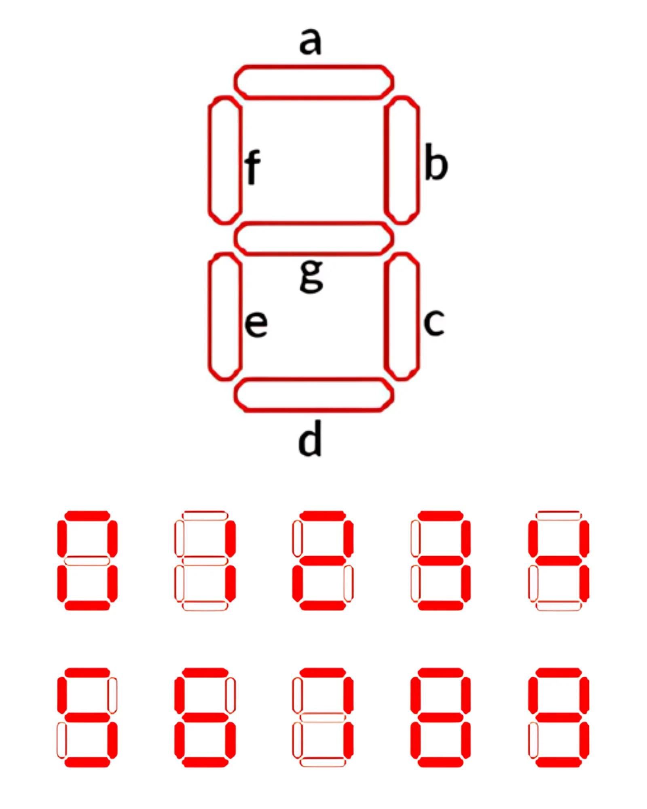
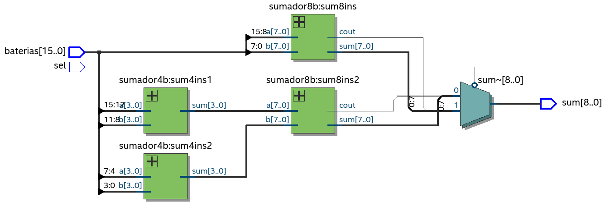
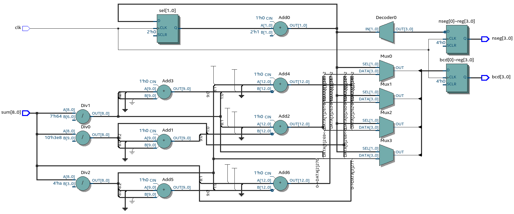
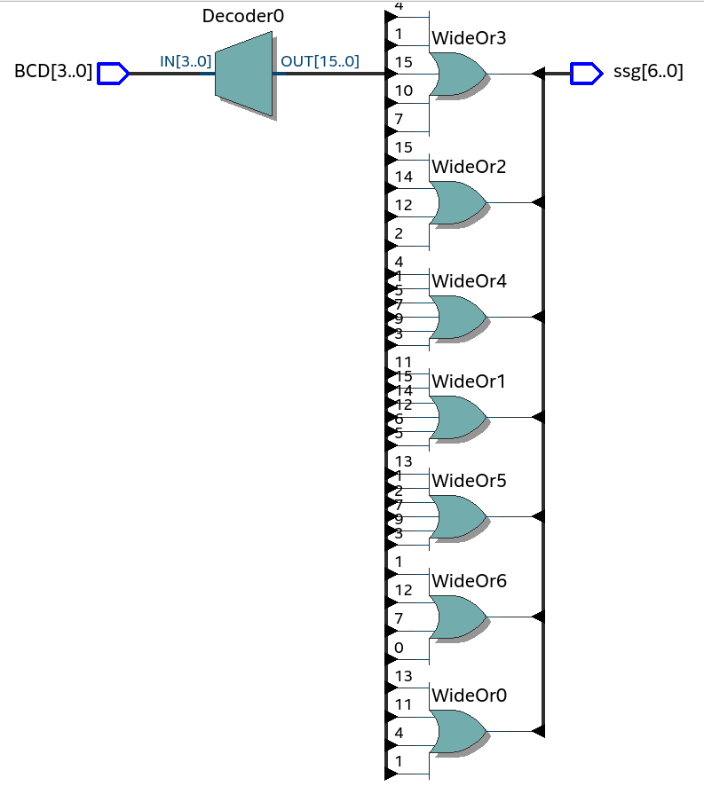
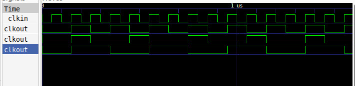

# Lab03 - Visualización del nivel de carga

# Integrantes

[Alejandro Diaz Cordoba](https://github.com/aldicor) \
[Juan David Bernal Sanchez](https://github.com/jbernalsa) \
[Juan David Sanchez Quintero](https://github.com/jdavid-sz)

# Informe

Indice:

1. [Diseño implementado](#diseño-implementado)
2. [Simulaciones](#simulaciones)
3. [Implementación](#implementación)
4. [Preguntas](#preguntas)
5. [Conclusiones](#conclusiones)
6. [Referencias](#referencias)

## Diseño implementado

### Descripción

#### Sumador

Para realizar la práctica, fue necesario implementar un [sumador](./sumador.v) de 4 y 8 bits. Para hacer más secilla la implementación, se decidió crear un módulo cuyas entradas fueran los 16 bits de las baterias, junto con un selector de 1 bit que corresponda a la configuración de la suma de las baterías: 4 de 4 bits, o 2 de 8 bits. Para la salida, se optó por una sola variable, sum, de 9 bits, capaz de representar hasta el número 511. Para el proyecto, el máximo valor que puede tomar la suma de las baterías es 510, por lo que no se generaran errores que dependan del este parámetro.

El diseño se realizó de tal manera que se reciclaron los archivos de la última práctica. Èl diseño implementado funciona de tal manera que la suma de las dos configuraciones se está calculando y asignando al mismo tiempo en dos salidas diferentes. La salida principal del módulo, en cambio, se conecta con una u otra de las salidas mencionadas en caso de que el selector sea 0 (2 baterías de 8 bits), o bien un 1 lógico (4 baterías de 4 bits). 

#### Binario a BCD

El objetivo del módulo [binBCD](./binBCD.v) es separar en unidades, decenas y centenas (el nùmero máximo que se va a trabajar es 510) la suma que viene del módulo anterior. Como el sistema decimal trabaja con 10 símbolos, cada uno de los dígitos fueron representador con 4 bits. Debido a que el display solo puede representar un número a la vez, es necesario asignar un valor al display que represente su posición. Por ejemplo, en el caso de las unidades, es necesario apagar los tres 7 segmenos izquierdos del display, y encender el otro. Como por cada display son 4 7 segmentos, la variable para representar cuál está encendido o apagado es de 4 bits. Esta serìa la otra variable de salida del módulo.

Por último, para generar una apariencia visual de continuidad en el número representado, las dos salidas de este módulo dependerán del posedge de un clock, en este caso, el de la FPGA, que es de 50MHz.  

#### BCD a 7 segmentos

El objetivo de este módulo es representar un número decimal de 0 al 9 (4 bits) en 7 segmentos (7 bits). Cada número se representa en un 7 segmentos por medio del siguiente mapa de asignación. Donde a corresponde al bit más significativo, mientras que g al bit mmenos significativo, en el diseño realizado. 

### Diagramas

#### Sumador

Tal y como se explicó anteriormente, este módulo recibe como entradas los pines de las baterías (16 bits) y un selector que cambia de configuración la suma, que es la salida del módulo, todo esto mediante modificaciones realizadas al módulo de suma de la práctica anterior. Tal y como se muestra a continuación:

#### Binario a BCD

Tal y como se explicó anteriormente, las entradas de este módulo son la suma de las baterías, así como un clk, mientras que las salidas corresponden a los dígitos de la suma (BCD), así como la información de cuál de los cuatro 7 segmentos prender (nseg). El siguiente diagrama representa el módulo implementado.  

#### BCD a 7 segmentos

A continuación se muestra el diagrama correspondiente al BCD a 7 segmentos, cuyas entradas son el dítito a representar (BCD, de 4 bits) y los valores de los 7 segmentos (ssg, 7 bits). Es importante mencionar que se usó lógica negativa: un 0 lógico representa el segmento encendido, mientras que un 1 lógico representa el segmento apagado.

#### Divisor de frecuencia

Para realizar el [divisor de frecuencia](./clockdiv.v), se optó por incluir un parámetro de división. Este parámetro indica el factor por el cual se divide la frecuencia de entrada. Por tanto, al conocer la frecuencia de entrada, se sabe automáticamente la frecuencia de salida al dividir la frecuencia de entrada por el factor ingrasado.

La idea es añadir un contador de los posedge del clock de entrada, cada posedge consistiría en un ciclo de la señal. Si el contador registra un número igual al factor de división, menos 1, 

## Simulaciones 

<!-- (Incluir las de Digital si hicieron uso de esta herramienta, pero también deben incluir simulaciones realizadas usando un simulador HDL como por ejemplo Icarus Verilog + GTKwave) -->

### Simulación del bloque divisor de frecuencia.

[Nota: Para que se pueda visualizar correctamente el comportamiento del divisor de frecuencia, no utilice el factor calculado para alternar la señal del ánodo del display de siete segmentos. En su lugar, emplee un factor que le permita observar claramente el funcionamiento del divisor durante la simulación.]:#

Para la realización de la práctica, se implemento un factor div de divisor de frecuencia igual a 400000, teniendo en cuenta que la FPGA opera con una frecuencia de 50MHz y siguiente la ecuación que se muestre así se obtuvo el período del clock de salida igual a 16ms. Para lograr esto se aprovechó la función posedge (flanco positivo) de verilog.

$$clkout = \frac{2 * 400000}{50MHz} = 16ms$$

En la imagen de la simulación que se muestra, se ajustó un testbench para mostrar el funcionamiento  con un factor div diferente pere simplemente nos fijamos en que uut usa un factor de división de frecuencia de 2, uut2 usa 3 y uut3 divide la frecuencia por 4.

### Simulación del bloque codificador de binario a BCD y decodificador BCD a 7 segmentos

## Implementación

## Preguntas

1. ¿Qué impacto tuvo aumentar el número de bits de la lectura de cada batería? ¿Qué impacto tuvo aumentar el número de baterías del banco? 

Al aumentar el número de baterias, el primer problema a solucionar fue el número de bits trabajados. La solución no pasó por cambiar la estructura del módulo, sino simplemente aumentar el número de bits en las variables trabajadas para que el código ya implementado funcionara. Por ejemplo, en el caso del sumador, no fue necesario modificar el código para el módulo de suma de 4 bits, sino simplemente escalar los valores de salida a la de los trabajaos.

Asimismo, aumentar el número de baterías implicó dividir los datos de entrada para que concordaran con los módulos establecidos. Una vez más, no fue necesario modificar los módulos establecidos, sino conectarlos lógicamente en un nivel superior.

2. ¿Cuál es la diferencia entre displays de cátodo común y ánodo común, y cómo afecta esto al diseño del decodificador?

3.  Explique la implementación que realizó del divisor de frecuencia a nivel de flip flops describiendo cómo cada flip-flop contribuye a la división de la frecuencia de la señal de entrada y cómo se relacionan sus estados con la salida final.

## Conclusiones

## Referencias

